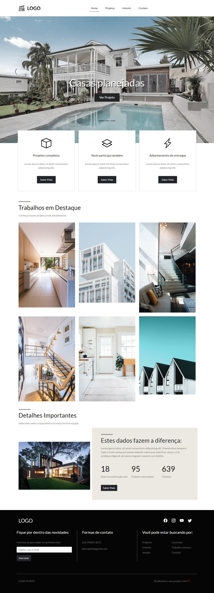

# enginner-portfolio
## Projeto de estudo realizado com a intuição de ser um portfólio para Engenheiros ou Arquitetos

Responsividade
O portfólio é totalmente responsivo para smartphones, tablets e desktops.

Frameworks
Os frameworks utilizados foram o Bootstrap, biblioteca para o CSS e o ScrollReveal.JS para o JavaScript, servindo para que quando use o scroll, possamos ver alguns elementos surgindo na tela.

## Imagem do Projeto Finalizado

